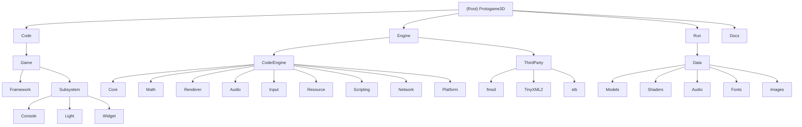

# Protogame3D - AI Documentation

## Changelog

**2025-09-22**: Initial AI context creation - Full project analysis and module documentation setup

---

## Project Vision

Protogame3D is a comprehensive 3D game engine and prototype game built with modern C++ architecture. The project demonstrates professional game development patterns including modular engine design, JavaScript scripting integration via V8, professional audio through FMOD, and a complete resource management pipeline. This serves as both a functional game prototype and a showcase of custom engine development techniques.

## Architecture Overview

The project follows a layered architecture with clear separation between engine and game logic:

- **Engine Layer**: Static library providing core systems (rendering, audio, input, resource management, scripting)
- **Game Layer**: Application executable implementing game-specific logic and entities
- **Asset Pipeline**: Organized data directory with models, shaders, textures, audio, and configuration
- **External Dependencies**: FMOD for audio, V8 for JavaScript, TinyXML2 for configuration

### Module Structure Diagram

## Module Index

| Module | Path | Type | Language | Responsibility |
|--------|------|------|----------|----------------|
| **Game** | `Code/Game` | Application | C++ | Main game application with player systems, entities, and game-specific subsystems |
| **Engine** | `Engine/Code/Engine` | Static Library | C++ | Core game engine providing rendering, audio, input, networking, resource management, and JavaScript scripting |
| **ThirdParty** | `Engine/Code/ThirdParty` | External Dependencies | C | External library dependencies including FMOD audio, XML parsing, and image loading |
| **Assets** | `Run/Data` | Game Assets | Various | Game assets including 3D models, textures, shaders, audio files, and fonts |
| **Documentation** | `Docs` | Documentation | Markdown | Project documentation and guides |

## Running and Development

### Prerequisites
- Visual Studio 2019/2022 with C++ development tools
- Git for version control and submodule management
- Windows 10/11 (x64)

### Building
1. Clone with submodules: `git clone --recursive <repository>`
2. Open `Protogame3D.sln` in Visual Studio
3. Select configuration (Debug/Release) and platform (x64 recommended)
4. Build Solution (Ctrl+Shift+B)

### Running
- Navigate to `Run/` directory
- Execute `Protogame3D_Debug_x64.exe` or `Protogame3D_Release_x64.exe`
- Configuration can be modified via `Run/Data/GameConfig.xml`

## Testing Strategy

The project structure indicates testing is primarily done through:
- **Integration Testing**: Via the main game executable
- **Manual Testing**: Through interactive gameplay and debug systems
- **Asset Validation**: Through the resource loading pipeline

**Note**: No dedicated unit test framework detected. Consider adding Google Test or similar for component-level testing.

## Coding Standards

### Project Structure
- **Header Files**: `.hpp` extension for C++ headers
- **Implementation**: `.cpp` for implementation files  
- **Namespace**: Engine components in appropriate namespaces
- **Memory Management**: RAII patterns with custom `SAFE_RELEASE` macros

### Architecture Patterns
- **Entity-Component**: Game objects use entity-based architecture
- **Subsystem Pattern**: Core systems as independent subsystems
- **Resource Management**: Handle-based resource system with caching
- **Event System**: Decoupled communication via event system

### Dependencies
- **FMOD**: Professional audio engine
- **V8**: JavaScript scripting engine
- **TinyXML2**: XML configuration parsing
- **DirectX 11**: Graphics API (Windows)
- **STB**: Image loading utilities

## AI Usage Guidelines

### Code Analysis Approach
1. **Architecture First**: Understand the modular separation between engine and game
2. **Subsystem Focus**: Each engine subsystem is self-contained with clear interfaces
3. **Resource Pipeline**: Asset loading follows a consistent handle-based pattern
4. **Memory Management**: Custom macros for safe pointer handling

### Development Patterns
- **Modular Design**: Clear boundaries between engine and game logic
- **Configuration-Driven**: XML-based configuration for game settings
- **Asset-Centric**: Rich asset pipeline with models, shaders, audio
- **Scripting Integration**: JavaScript via V8 for rapid prototyping

### Key Integration Points
- **Renderer**: Direct3D 11 with shader support
- **Audio**: FMOD integration for 3D positional audio
- **Input**: Xbox controller and keyboard/mouse support
- **Scripting**: V8 JavaScript engine for gameplay logic
- **Resources**: Type-safe resource handles with async loading

---

*Last updated: 2025-09-22*